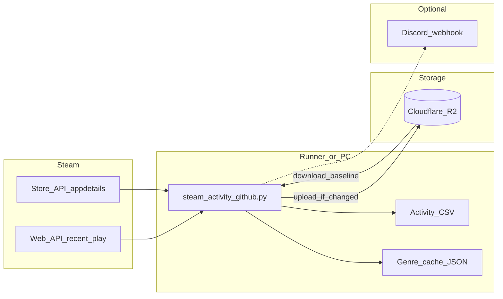

# Stream — Steam activity sync

A small **personal activity log** for Steam: it pulls your **recently played** data via the **Steam Web API**, enriches titles with **store metadata** (genres, categories, free/paid) into a local cache, appends **playtime deltas** to a CSV, and keeps the artifacts in **Cloudflare R2** (download first, upload only when content changes). Optional **Discord** notifications run on success or failure. **GitHub Actions** runs on a schedule so each job starts from a clean checkout and restores state from R2.

[](https://github.com/Fayiette/Steam-Data-Update/actions/workflows/steam-fetch.yml)

---

## What it does

| Piece | Role |
| ----- | ---- |
| **Activity CSV** | Rows keyed by day and game: playtime gained since last snapshot, genres, categories, timestamps. |
| **Genre cache** | JSON map of app id → metadata from the Steam store API (reduces repeat calls). |
| **R2** | Canonical storage for both files; object keys match the configured **filenames** (flat keys). |
| **Discord** | Optional webhook for run summaries; uncaught failures send **detailed** text to Discord while **stdout** stays generic (useful when Action logs are public). |

On **GitHub Actions**, the workflow injects configuration from **environment secrets**; locally you use a `.env` file. Artifact **names** are not hardcoded in code—they must be set via environment variables everywhere.

---

## Architecture (high level)



---

## Features

- **Steam Web API** for recently played games (requires a Web API key and your Steam ID).
- **Store API** lookups for genre/category enrichment, with a **per-app delay** to stay polite.
- **R2 sync**: pull both artifacts at start; **SHA-256** comparison skips upload when unchanged.
- **Day bucketing**: runs before **07:00 UTC** are attributed to the **previous calendar day** in the script (see code for exact rule).
- **Configurable artifact filenames** via environment variables only (required; no built-in defaults).

---

## Requirements

- **Python 3.12+** (matches the workflow; slightly older may work if dependencies install.)
- Dependencies in [`requirements.txt`](requirements.txt): `requests`, `boto3`, `python-dotenv`.
- Services: **Steam Web API** access, **Cloudflare R2** (S3-compatible endpoint and credentials), optional **Discord** webhook.

---

## Local usage

1. Clone or copy this project.
2. Copy [`.env.example`](.env.example) to `.env` and set **every required variable** (the script exits if artifact names or other required keys are missing or empty).
3. Install and run:

```bash
pip install -r requirements.txt
python steam_activity_github.py
```

Artifacts are written next to the script (same directory as `steam_activity_github.py`).

---

## GitHub Actions

The workflow [`.github/workflows/steam-fetch.yml`](.github/workflows/steam-fetch.yml) uses:

- **`environment: prod`** — define **environment secrets** on `prod` (Settings → Environments → `prod`) using the **same variable names** referenced in the workflow file. Do not commit real values.
- **Schedule** — every **2 hours** at minute `0` **UTC** (GitHub may delay runs slightly under load), plus **`workflow_dispatch`** for manual runs.

Do **not** paste secrets, API keys, webhook URLs, bucket names, endpoints, Steam IDs, or artifact filenames into issues or the README—use secret storage only.

---

## Environment variables

Authoritative names and notes live in [`.env.example`](.env.example). Required entries include Steam API credentials, R2 settings, Discord webhook, and the two artifact filename variables. `DISCORD_USER_ID` is optional (used for failure mentions).

---

## Third-party services and responsibility

This project uses **Valve’s Steam Web API** and **store endpoints**. You are responsible for complying with [Steam / Valve’s applicable terms](https://steamcommunity.com/dev) and for any data you store in R2 or elsewhere. This software is provided as-is; it is not affiliated with Valve.

---

## License and credit

This project is licensed under the **GNU Affero General Public License v3.0** — see [`LICENSE`](LICENSE) for the full text.

- **Sharing** is allowed under the license terms.
- **Attribution / license notices** must be preserved as required by the license (including interactive use where applicable).

---

## Contributing and forks

Pull requests is disabled; forks are welcome. Preserve copyright and license notices in any distribution you make.
